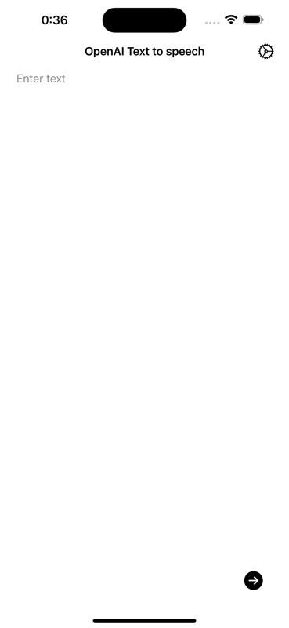
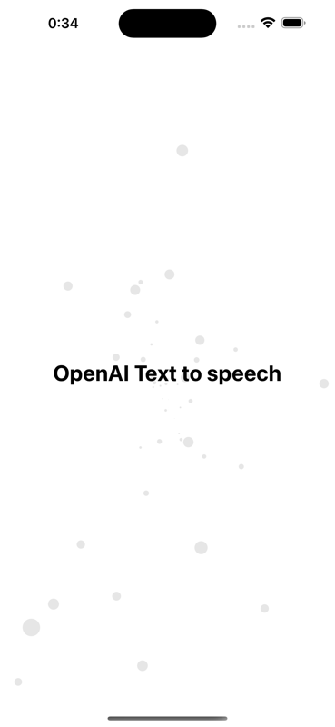
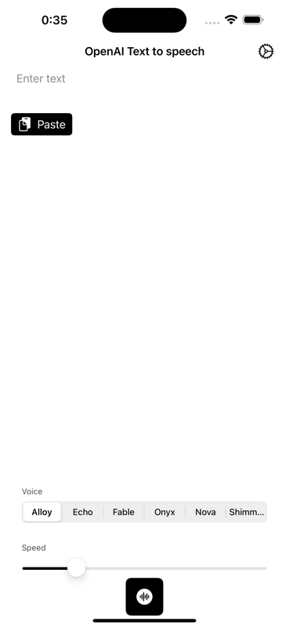
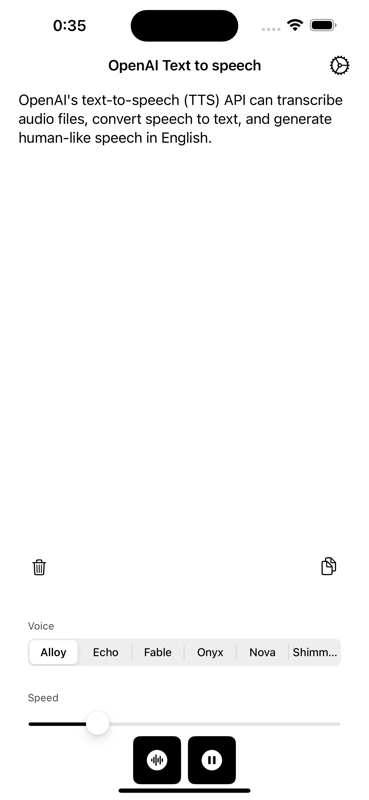

# Overview

This app is written SwiftUI using OpenAI TTS demonstration app. you can demo OpenAI TTS trough this app.

And you can check OpenAI TTS API structure in here.
https://platform.openai.com/docs/guides/text-to-speech

# Application Image

   
